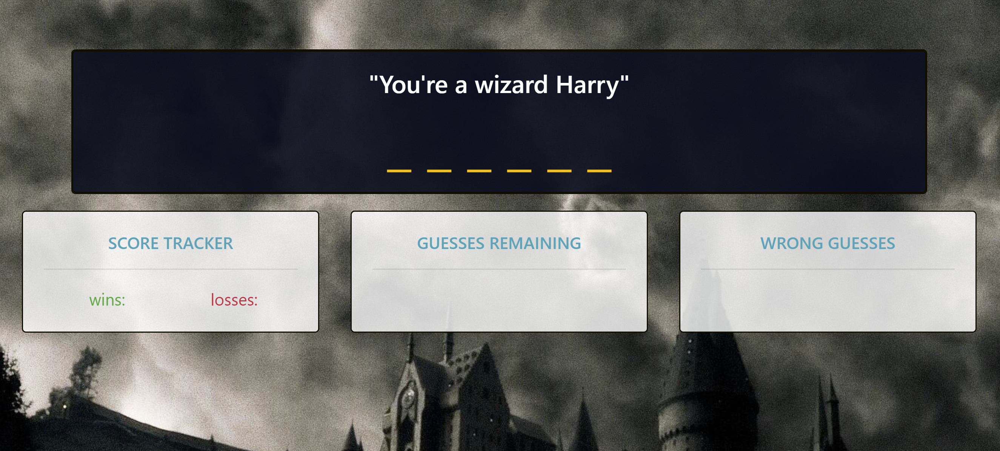
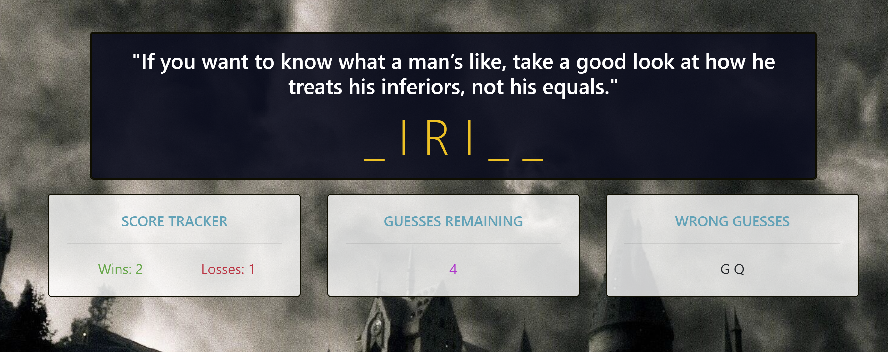

# Which Witch

**Word Guess Game**

Live site: <https://dee1985.github.io/which-witch/>

Landing page: 

Description and Usage: Simple word guessing game based on Harry Potter characters. The concept is similar to the game "Hangman." A hidden word is displayed with it's length represented by dashes. In this instance, a quote from one of the Harry Potter character's is randomly selected, but the character's name is hidden. The object of the games is for the user to correctly guess the name before the number of guesses gets to zero. For extra fun, sound effects have also been included!

Instructions: From the home page, press any key to start the game. The user has access to a list of character names, via modal activation, at the start of the game only. The game allows for 6 guesses per round.

Start of game: 

If the user guesses incorrectly, 1 point is subtracted from their "guesses remaining" and the wrong guess is displayed for reference. Each guess (valid keypress) is also associated with an success sound or a failure sound. For each round the user wins or loses, 1 point will be added to their total "wins" or "losses".

Game in progress: 

Installation: No installation required.

Contributions: A lot of Google Fu!

Challenges: Conceptualizing and organizing my code in a rational manner. Road bumps like, when to use a boolean, how nested can conditionals or loops be, and styling were difficult and time consuming. Also, what is considered acceptable "clean" code for me at this point in my web development career, was also something I struggled with. But, surprisingly, deciding when to step away from the work was probably the most challenging.

Successes: I did enjoy adding sound effects as a bonus.

Future Plans: Attempting the project again, but using an OOP approach and adding further logic to further fine tune the score keeping.
